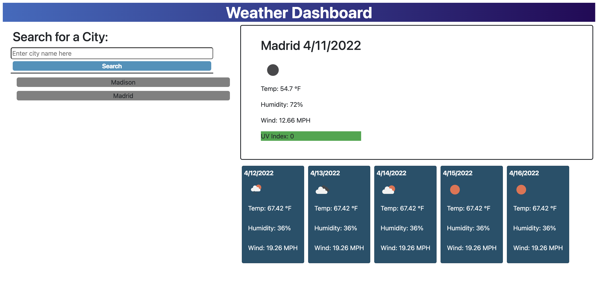

 # weather-dashboard

 ## Built with 
 * HTML
 * CSS
 * Javascript
 * Jquery
 * DayJS
 * Bootstrap
 * OpenWeather API

 ## Website: https://aubree-alexander.github.io/weather-dashboard/

## Description/Purpose
* Challenge for UW Extensions Coding Bootcamp. 
* Functionality: User can search for any city and the both the current weather data as well as 5-day forecast data will be displayed. 
 

## User Story 
GIVEN a weather dashboard with form inputs
WHEN I search for a city
THEN I am presented with current and future conditions for that city and that city is added to the search history
WHEN I view current weather conditions for that city
THEN I am presented with the city name, the date, an icon representation of weather conditions, the temperature, the humidity, the wind speed, and the UV index
WHEN I view the UV index
THEN I am presented with a color that indicates whether the conditions are favorable, moderate, or severe
WHEN I view future weather conditions for that city
THEN I am presented with a 5-day forecast that displays the date, an icon representation of weather conditions, the temperature, the wind speed, and the humidity
WHEN I click on a city in the search history
THEN I am again presented with current and future conditions for that city

## Contribution
Aubree Alexander

## Screenshot
